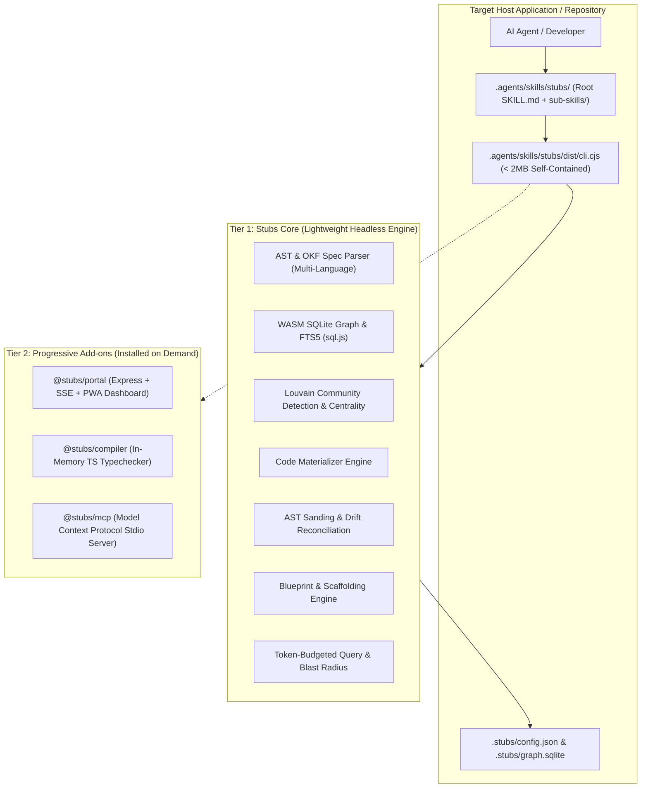

# Stubs Lite & Tiered Add-on Architecture Blueprint

## 1. Problem Framing & Motivation

The full `stubs` repository provides an end-to-end framework featuring an Express web portal, browser PWA dashboard, in-memory TypeScript compiler typechecker, AST parsing across languages, SQLite graph database with FTS5 search, and multi-step lifecycle engines.

When deploying `stubs` into external applications or third-party repositories:
- Installing full server dependencies and web UI assets introduces unnecessary bloat when developers/agents only require headless CLI automation and GraphRAG context.
- Target repositories require a **zero-dependency, lightweight skill bundle** that can be dropped in instantly or initialized via a single command, with zero native compilation dependencies (`node-gyp`).

## 2. Tiered System Architecture

## 3. Subsystem Breakdown

### 3.1 Tier 1: Stubs Core (Headless Skill)
- **Zero Runtime Dependencies:** Bundled as a standalone CJS file (`dist/cli.cjs`, ~1.8 MB) using `esbuild` with embedded WebAssembly SQLite (`sql.js`) and YAML parser (`js-yaml`).
- **Graph & Intelligence:** Retains full AST symbol extraction, Louvain community clusters, PageRank centrality, caller/callee traversal, and token-budgeted GraphRAG querying (`query`, `explain`, `blast`).
- **Lifecycle Engines:** Includes `concept` (scaffolding blueprints), `materialize` (sidecar extraction), `sand` (bi-directional AST hash sync), `lint` (architectural layer validation), and `map` (context map auditing).

### 3.2 Tier 2: Progressive Extensions
- **`@stubs/portal`:** Provides `stubs serve` / `stubs portal` with the live Express server, Server-Sent Events, PWA browser client, and GitHub API bridge.
- **`@stubs/compiler`:** Provides deep in-memory typechecking via TypeScript's programmatic compiler API.
- **`@stubs/mcp`:** Provides a standardized Model Context Protocol JSON-RPC stdio server for IDE agent integration.

## 4. Operational Workflows

### 4.1 Initialization (`npx stubs init`)
1. Generates minimal `.stubs/config.json`.
2. Populates `.agents/skills/stubs/` with the lean root `SKILL.md`, sub-skills directory, and the standalone `dist/cli.cjs` binary.
3. Automatically executes an initial `stubs scan` to index the project.

### 4.2 Progressive Add-on Installation (`stubs add <addon>`)
- Installs requested extension package locally or triggers ephemeral invocation (e.g. `npx @stubs/portal`).

### 4.3 Version-Locked Safe Updates (`stubs update`)
- Fetches the latest core binary and sub-skills.
- Atomically replaces `.agents/skills/stubs/dist/cli.cjs` and core sub-skills.
- Automatically applies incremental schema migrations to `.stubs/graph.sqlite`.
- **Never** overwrites user-defined templates (`.stubs/templates/`) or custom configuration in `.stubs/config.json`.

## 5. Agent Skill Structure (Progressive Disclosure)

- **Root `SKILL.md` (< 100 lines):** Functions as the master decision matrix and routing table. Outlines the 5-phase lifecycle and maps agent intentions directly to specific sub-skills and CLI commands.
- **Sub-skills (`sub-skills/<domain>/SKILL.md`):** Deep-dive execution playbooks loaded on demand for specific tasks:
  - `conceptualizing`: Problem framing & blueprints
  - `context-mapping`: Context map scaffolding and audit
  - `context`: Token-optimized GraphRAG briefs (`explain`, `query`, `blast`)
  - `grilling`: Spec stress testing & frontier decision trees
  - `materialization`: Sidecar code extraction
  - `sanding`: Structural drift reconciliation
